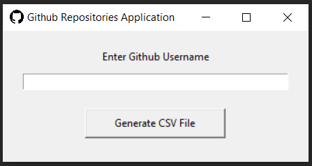
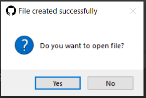

# Github Repositories Web Scraping Application

## Project Overview

This project is a simple GUI application built in Python that takes a GitHub username as input, scrapes the user's public repositories, and generates a CSV file with the repository names. The application also provides an option to open the generated CSV file with the default associated program.

## Features

- **User Input:** Enter a GitHub username through a simple GUI.
- **Web Scraping:** Fetch repository data from the user's GitHub page.
- **CSV Generation:** Generate a CSV file containing the names of the public repositories.
- **Open CSV File:** Option to open the generated CSV file with the default associated program.

## Getting Started

### Prerequisites

- Python (3.6 or higher)
- Required Python packages (install using `pip install -r requirements.txt`):
  - `requests`
  - `beautifulsoup4`
  - `tkinter`

### Installation

1. Clone the repository:

    ```bash
    git clone https://github.com/reda-mohsen/Web_Scraping_Application.git
    ```

2. Navigate to the project directory:

    ```bash
    cd Web_Scraping_Application
    ```

3. Install the required Python packages:

    ```bash
    pip install -r requirements.txt
    ```

## Usage

1. Run the application:

    ```bash
    python main.py
    ```
2. Enter a GitHub username in the GUI and click the "Generate CSV File" button.
<br>  <br>
3. The application will create a CSV file (`repo_names.csv`) with the names of the public repositories.
4. Optionally, choose to open the generated CSV file.
<br>  <br>

## Acknowledgements

- [tkinter](https://docs.python.org/3/library/tkinter.html) - GUI library for Python.
- [Beautiful Soup](https://www.crummy.com/software/BeautifulSoup/) - Python library for web scraping.
- [Requests](https://docs.python-requests.org/en/latest/) - HTTP library for Python.
